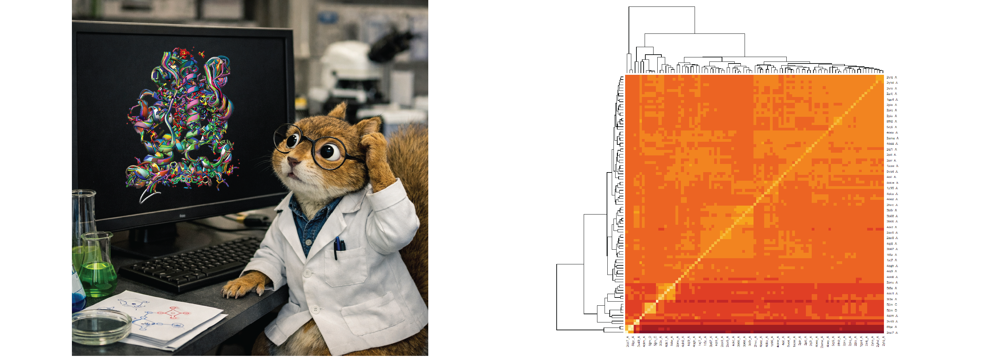

# Bio3D-for-multiple-structures

Este repositorio tiene varios scripts generales para ser usados en R/Rstudio para el análisis y clasificación de estructuras de proteínas.

El Abstract Gráfico desplegado en arriba corresponde al resumen que se sometió al 3er Congreso Nexus: de la bioinformática a la experimental.

El poster esta en formato PDF [Poster](posterNEXUS3.pdf)

El material del poster se generó con el script ProteinPCA-localsv2.0.R

El script ProteinPCA-specificv2.0.R realiza operaciones semejantes.

Contacto: lenin.dominguez.ramirez@proton.me
